# CakePHP研修_01日目

## 研修概要

この研修ではPHPのフレームワークであるCakePHPについて学習します。
簡易な社員研修システムを構築し、フレームワークを利用したシステム開発を経験します。

### CakePHPとは

<!-- TODO 詳細は後で記載 -->
CakePHPはウェブ開発を単純、簡単に出来る様に開発されたPHP用のフレームワークです。

## 開発環境構築

<!-- TODO 以下の環境を構築予定 -->
<!--  -->
<!-- - httpサーバー:Apache -->
<!-- - PHP:8.1 -->
<!-- - MySQL:5.6以上 -->
<!-- - CakePHP:4.4.3 -->

### XAMMPを用意する

「XAMPP(ザンプ)」はPHP開発に必要な環境を簡単に構築することができるオープンソースのパッケージです。
PHP、Webサーバー、DBサーバーといったものがまとめられ、インストールするだけでPHP開発環境を整えることができます。

```
https://www.apachefriends.org/jp/index.html
```

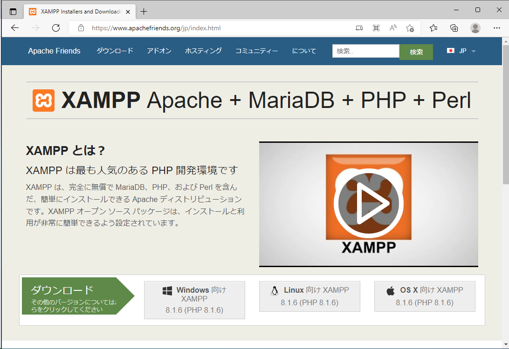

このページから最新のインストーラをダウンロードすることができます。


### XAMMPのインストール

今回はWindows版のインストーラ「xampp-windows-x64-8.1.6-0-VS16-installer.exe」をダウンロードします。
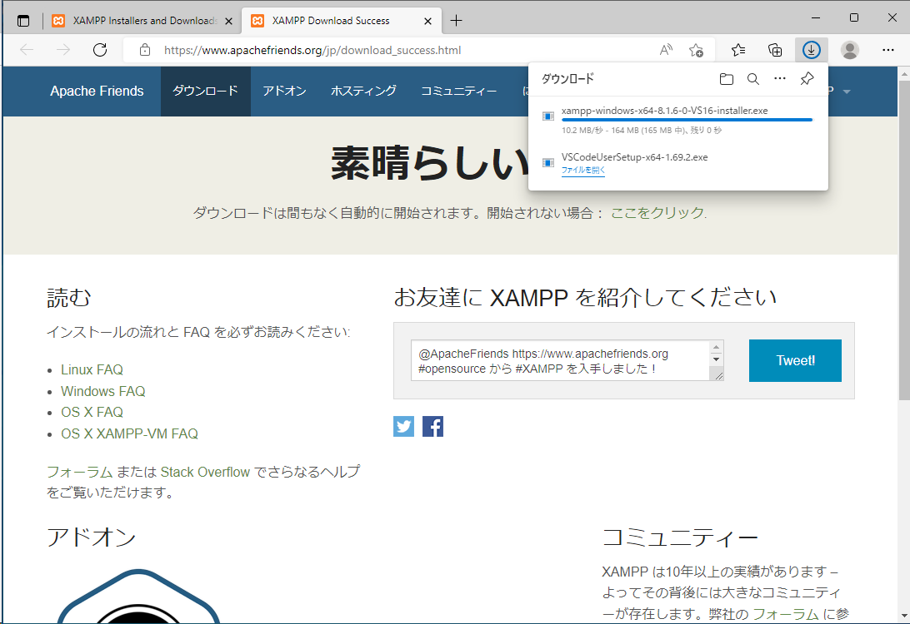

インストーラを実行します。

nextを押下する
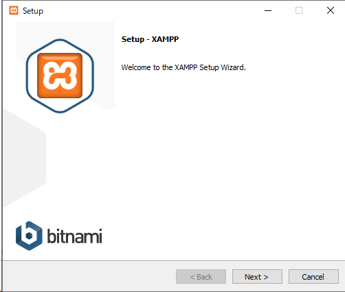

デフォルトのままでnextを押下する


インストール場所の指定
デフォルトのままでnextを押下する
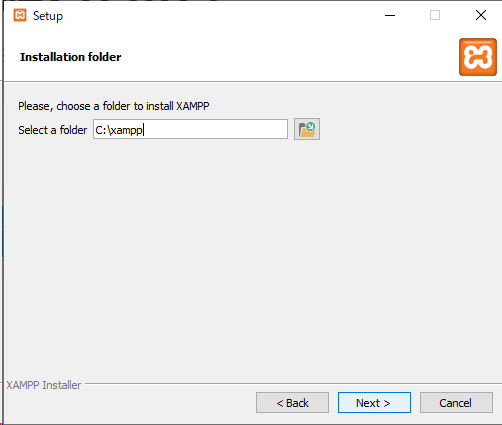

使用言語の指定
デフォルトのままでnextを押下
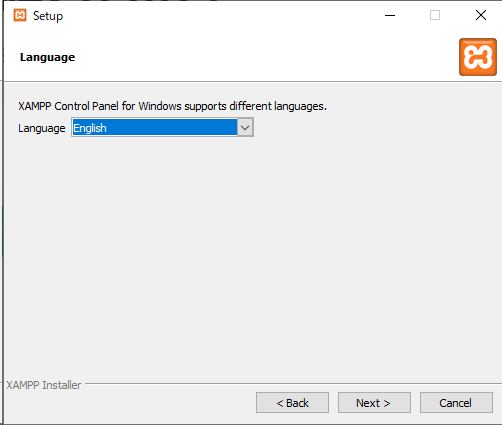

宣伝
nextを押下
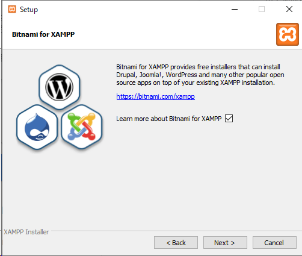
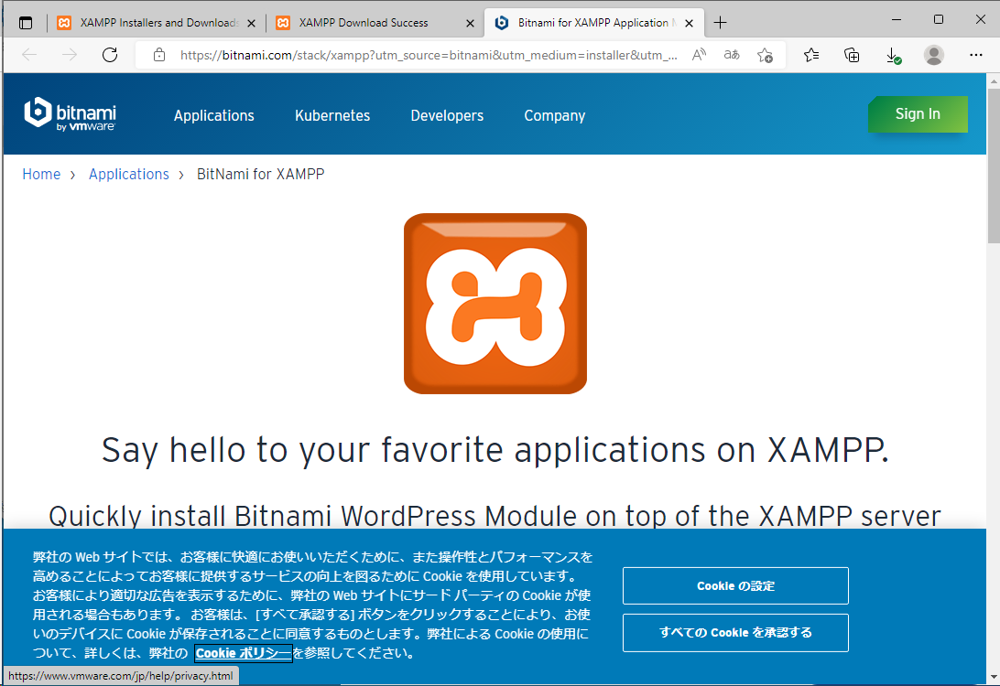

nextを押下
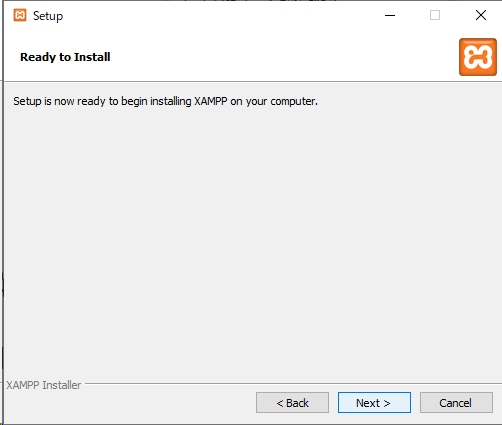

インストール中
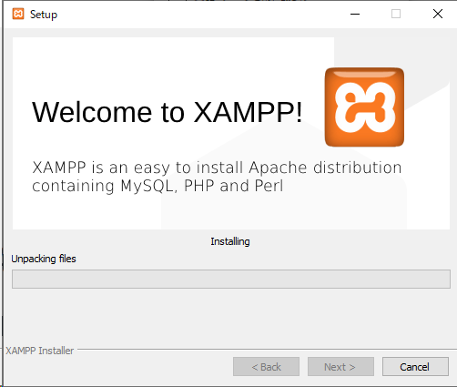

インストール完了  
Finishを押下すると自動的にコントロールパネルが起動する
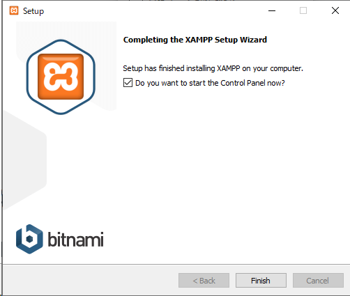

### XAMPPのコントロールパネルについて

インストールが終わるとコントロールパネルが起動します

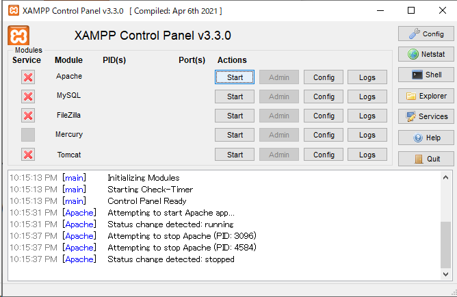

<!-- TODO XAMPPコントロールパネルについて軽く説明を入れる -->

### PHPコマンドの動作確認

XAMPPがインストールできたらPHPのコマンドが実行できるようにします。
コマンドプロンプトを開いて以下のコマンドを実行してください。

``` cmd
php -v
```

<!-- TODO 設定後PHPコマンドが実行できることを確認 -->
バージョンが表示されることを確認する


### Composerのインストール

<!-- TODO Composerについてもう少し詳しく書く -->
Composer(コンポーザー)の準備をします。これは、PHPベースの「パッケージ管理ツール」です。
以下のサイトで公開されています。

```
https://getcomposer.org/
```

 [こちら](https://github.com/composer/windows-setup/releases/) からWindows用のインストーラをダウンロードできます。  
`Composer-Setup.6.3.0.exe` を実行してください。  
インストールウィザードに従ってインストールをする。設定はデフォルトのまま  
インストールが完了したらコマンドプロンプトを新しく起動し、下記コマンドを実行する。

``` cmd
composer --version
```

下記のようにバージョン情報が表示されればOK

``` cmd
C:\Users\WDAGUtilityAccount>composer --version
Composer version 2.4.0 2022-08-16 16:10:48
```

### エディタの準備

開発用のエディタにはMicroSoft製のオープンソースソフトウェア Visual Studio Codeを使用する。

<!-- TODO PHP開発に必要な拡張機能について記載する -->

## CakePHPのプロジェクトを作成する

<!-- TODO プロジェクト配置場所は指定する -->
Composerをインストールしたら任意のコマンドプロンプトを開き、任意のフォルダで以下のコマンド実行します。

<!-- TODO プロジェクト名は後で変えるかもしれない -->
```
composer self-update && composer create-project --prefer-dist cakephp/app:"4.*" cake_php_sample
```

`cake_php_sample`ディレクトリ内にプロジェクトがセットアップされます。
セットアップが完了したら動作確認をします。
以下のコマンドをを実行してみましょう

```
cd cake_php_sample
bin/cake server
```

<!-- TODO Windowsで実行時にエラーが出る場合があるので調査して対応する -->

## データベースの準備

### テーブルを作る

### データの投入

## 社員情報を画面に表示する
