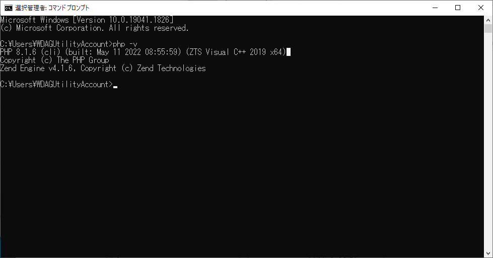

# CakePHP研修_01日目

## 研修概要

この研修ではPHPのフレームワークであるCakePHPについて学習します。
簡易な社員研修システムを構築し、フレームワークを利用したシステム開発を経験します。

### CakePHPとは

<!-- TODO 詳細は後で記載 -->
CakePHPはウェブ開発を単純、簡単に出来る様に開発されたPHP用のフレームワークです。

## 開発環境構築

開発環境を構築していきます。
<!-- TODO 以下の環境を構築予定 -->
<!--  -->
<!-- - httpサーバー:Apache -->
<!-- - PHP:8.1 -->
<!-- - MySQL:5.6以上 -->
<!-- - CakePHP:4.4.3 -->

### XAMMPを用意する

「XAMPP(ザンプ)」はPHP開発に必要な環境を簡単に構築することができるオープンソースのパッケージです。
PHP、Webサーバー、DBサーバーといったものがまとめられ、インストールするだけでPHP開発環境を整えることができます。

``` url
https://www.apachefriends.org/jp/index.html
```


このページから最新のインストーラをダウンロードすることができます。


### XAMMPのインストール

今回はWindows版のインストーラ「xampp-windows-x64-8.1.6-0-VS16-installer.exe」をダウンロードします。  


インストーラを実行します。

nextを押下する  


デフォルトのままでnextを押下する  


インストール場所の指定  
デフォルトのままでnextを押下する  


使用言語の指定
デフォルトのままでnextを押下


宣伝
nextを押下


nextを押下


インストール中


インストール完了  
Finishを押下すると自動的にコントロールパネルが起動する


### XAMPPのコントロールパネルについて

インストールが終わるとコントロールパネルが起動します


<!-- TODO XAMPPコントロールパネルについて軽く説明を入れる -->

### PHPコマンドの動作確認

XAMPPがインストールできたらPHPコマンドが実行できるか確認します。
コマンドプロンプトを開いて以下のコマンドを実行してください。

```
php -v
```

PHPのバージョン情報が表示されればOKです。

再度phpコマンドを実行しバージョンが表示されることを確認する



### Composerのインストール

<!-- TODO Composerについてもう少し詳しく書く -->
Composer(コンポーザー)の準備をします。これは、PHPベースの「パッケージ管理ツール」です。
以下のサイトで公開されています。

```
https://getcomposer.org/
```

<!-- TODO Downloadページに従ってインストールする手順を記載する -->
コマンドプロンプトから以下のスクリプトを実行します

### エディタの準備

開発用のエディタにはMicroSoft製のオープンソースソフトウェア Visual Studio Codeを使用する。

<!-- TODO PHP開発に必要な拡張機能について記載する -->

## CakePHPのプロジェクトを作成する

ComposerをインストールしたらCakePHPのプロジェクトを作成して行きます。  
power shellを開き、任意のフォルダで以下のコマンド実行します。  
以下の手順では`c:¥kensyu`を作業フォルダとして説明します。  

``` cmd
composer self-update && composer create-project --prefer-dist cakephp/app:"4.*" cake_php_sample
```

`cake_php_sample`ディレクトリ内にプロジェクトがセットアップされます。
セットアップが完了したら動作確認をします。
以下のコマンドをを実行してみましょう

``` powershell
cd cake_php_sample
bin/cake server
```

サーバー起動時に以下のエラーが出る場合があります。

``` powershell
PHP Fatal error:  You must enable the intl extension to use CakePHP. in C:\Users\WDAGUtilityAccount\Desktop\test\cms\config\requirements.php on line 31

Fatal error: You must enable the intl extension to use CakePHP. in C:\Users\WDAGUtilityAccount\Desktop\test\cms\config\requirements.php on line 31
```

これはintlという機能拡張が読み込まれていない為エラーが発生しています。  
PHPの設定を修正する事で対応できます。  
`c:xampp/php/php.ini` を開き以下の行を探してください。  

``` text
;extension=intl
```

見つけたら先頭の`;`を削除しファイルを保存します。  
先ほど作成した`cake_php_sample`ディレクトリを削除しコマンドを再実行してください。  
途中で権限設定を行うか聞かれるので `Y` を入力しEnterキーを押します。  

```
Set Folder Permissions ? (Default to Y) [Y,n]?
```


## データベースの準備

### テーブルを作る

### データの投入

## 社員情報を画面に表示する
