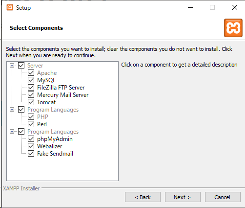

# CakePHP研修_01日目

- 研修概要
  - CakePHP概要
- 開発環境構築

## 研修概要

この研修ではPHPのフレームワークであるCakePHPについて学習します。
簡易な社員研修システムを構築し、フレームワークを利用したシステム開発を経験します。

### CakePHPとは

<!-- TODO 詳細は後で記載 -->
CakePHPはウェブ開発を単純、簡単に出来る様に開発されたPHP用のフレームワークです。

## 開発環境構築

<!-- TODO 以下の環境を構築予定 -->
<!--  -->
<!-- - httpサーバー:Apache -->
<!-- - PHP:8.1 -->
<!-- - MySQL:5.6以上 -->
<!-- - CakePHP:4.4.3 -->
<!--  -->
<!-- Apache,PHP,MySQLに関してはXAMPPでまとめてインストールすることも検討している -->

### XAMMPのインストール

[XAMMP https://www.apachefriends.org/jp/index.html](https://www.apachefriends.org/jp/index.html) にアクセスしインストーラをダウンロードする


nextを押下する


デフォルトのままでnextを押下する


インストール場所の指定
デフォルトのままでnextを押下する


使用言語の指定
デフォルトのままでnextを押下


宣伝
nextを押下


nextを押下


インストール中


インストール完了  
Finishを押下すると自動的にコントロールパネルが起動する


### XAMPPのコントロールパネルについて

インストールが終わるとコントロールパネルが起動します


<!-- TODO コントロールパネルについて軽く説明を入れる -->

### PHPの初期

XAMPPがインストールできたらPHPのコマンドが実行できるようにします。
コマンドプロンプトを開いて以下のコマンドを実行してください。

```
php -v
```

まだPHPのコマンドが認識されていないため、エラーメッセージが表示されます。

### エディタ等の設定

## 最初のプロジェクト作成

### データベースの構築

### プロジェクト作成
